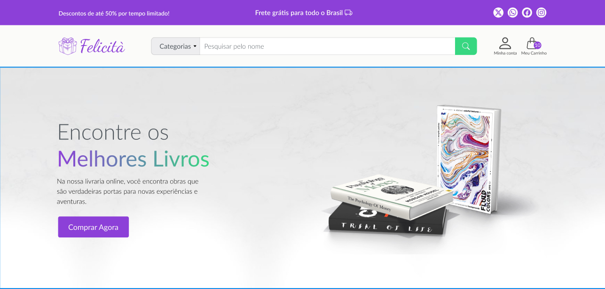
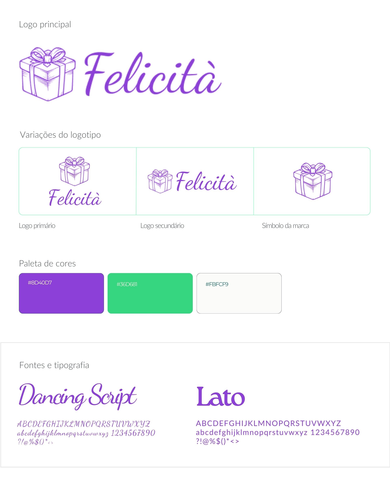

  

#    

**Felicità** é e-commerce voltado para a venda de presentes, com uma variedade de produtos que inclui **livros, brinquedos, camisas, canecas e consoles**. A proposta da nossa loja é oferecer uma experiência de compra online prática e agradável, com uma interface intuitiva e um catálogo diversificado que atende diferentes gostos e ocasiões. 

A plataforma é segura e eficiente, onde os clientes podem encontrar o presente ideal para qualquer pessoa, com facilidade e confiança.

## Tecnologias

## Planejamento

### Identidade Visual:

 

### Layout do projeto:

 - [Link do figma](https://www.figma.com/design/88In7BDcxg9n2IFjZbwRa1/Felicit%C3%A0?node-id=135-2&t=BG4GgcVCToiFLUUe-1)

### Gerenciamento das tarefas:

 

- [Guia de apresentação do quadro](https://imminent-politician-8bc.notion.site/Quadro-do-trello-439a4326cf3841c48ad80b0a94d6471f)

 - [Vídeo de apresentação do quadro](https://imminent-politician-8bc.notion.site/Quadro-do-trello-439a4326cf3841c4https://www.youtube.com/watch?v=LBDSQf4HVy8)

### Gitflow do projeto:

- [Guia de etapas do gitflow do projeto](https://imminent-politician-8bc.notion.site/Gitflow-do-projeto-4d8af11ddebf4c609278ce42af2af8e8)

- [Vídeo de apresentação do gitflow do projeto](https://www.youtube.com/watch?v=BJ5D6dSUpA0)

- [Orientações sobre commits](https://github.com/iuricode/padroes-de-commits)

  